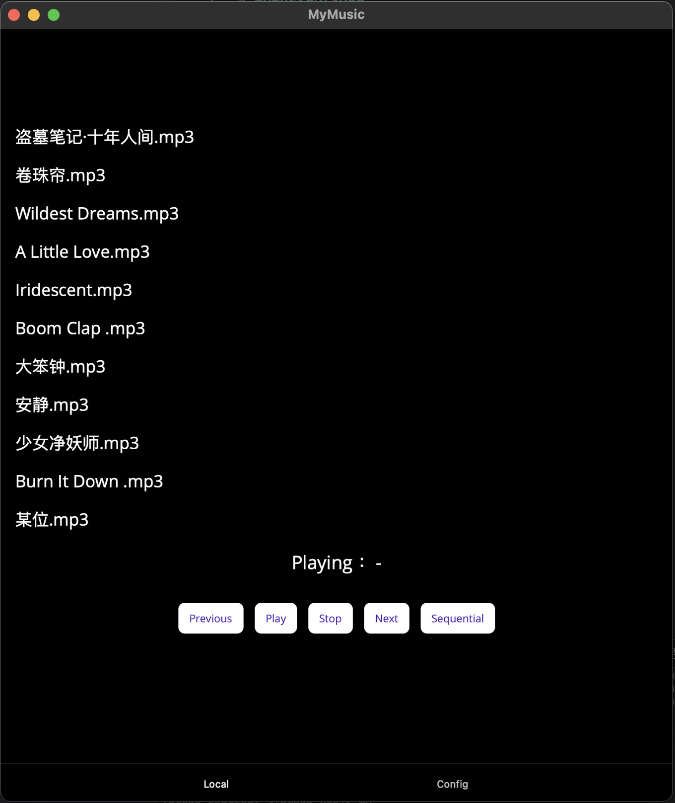
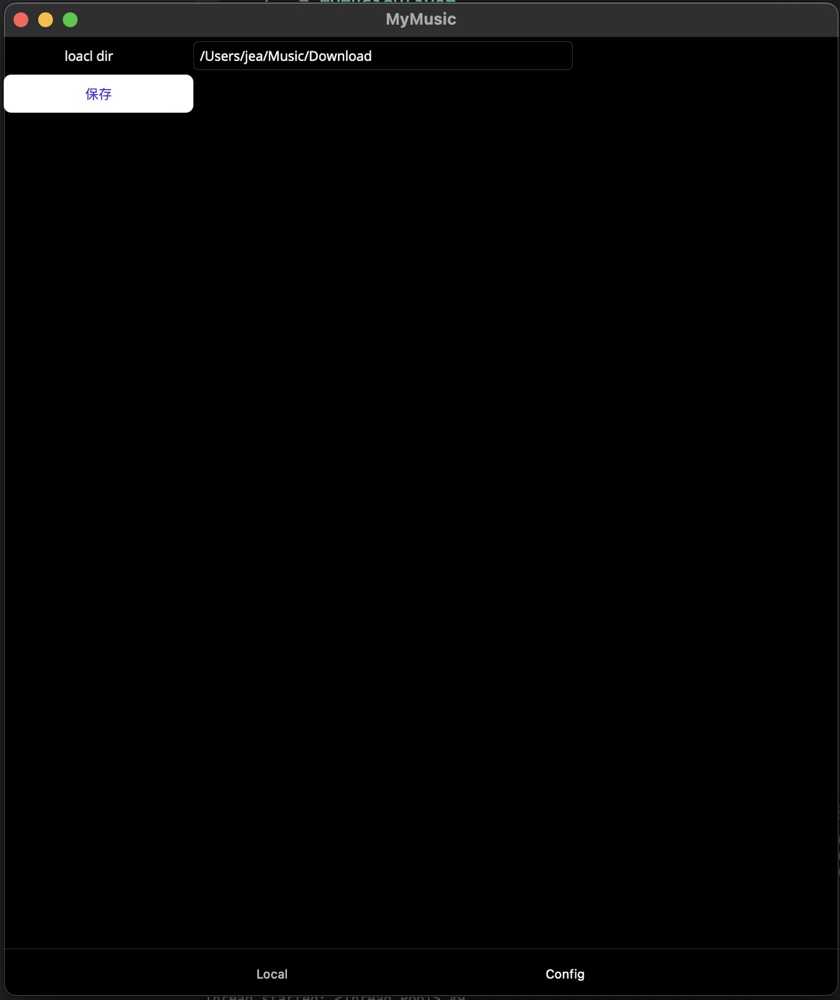

# MyMusicPlayer

### A cross platform local music player. Do not need network.
    
    

### use
- open
- click Config button, the button was not same with difference platform
    - MacOS: bottom
    - windows: top

- fill the directory of music .
- click save
- restart player.
- enjoy

### because of maui not support global hot key, I don't konw howto do this . after maui update ,I will update.

### License MIT